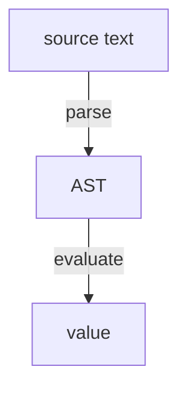
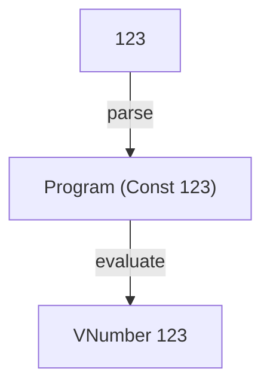

## Welcome to Tiny Interpreters

In Tiny Interpreters, we're going to learn how programming languages work by building tiny interpreters. We'll kick things off in Elm. Each post will focus on one small language feature or idea at a time, so we can understand it clearly before moving on.

Our first interpreter is called CONST.

A complete CONST program is just a non-negative integer literal:

```txt
123
```

## Table of contents

## Why CONST?

Evaluating an integer literal isn't especially interesting by itself. What makes CONST useful is that it lets us see the complete structure of an interpreter without other language features getting in the way.

There are no arithmetic expressions, Boolean expressions, conditionals, variables, let bindings, or functions to think about yet. That's intentional. Each of those ideas deserves attention, and we'll get to them later. For now, I want the structure needed to take a program from source text to a value to be as clear as possible.

Even though CONST is tiny, it still gives us the major pieces of an interpreter:

- a grammar that describes valid programs
- a lexer that recognizes non-negative integer literals
- an abstract syntax tree (AST) that represents the program in Elm
- a parser that turns source text into an AST
- evaluation logic that turns the AST into a value
- tests that describe the behaviour of the language

Once those pieces are in place, future interpreters can preserve the same basic shape as the language grows. Each new language feature will lead us to ask:

- How does the grammar change?
- How does the lexer change?
- How does the AST change?
- How does the parser change?
- How does evaluation change?
- What tests describe and protect the new behaviour?

That's why we start with CONST: it's small enough to understand all at once, while still giving us the foundation for everything that follows.

You can find the [complete source code for CONST on GitHub](https://github.com/tinyinterpreters/const).

## The interpreter pipeline

Before we look at the individual modules, it helps to see the overall pipeline.

A CONST program starts as source text:

```txt
123
```

If the source text is valid, the parser turns it into an AST:

```elm
Program (Const 123)
```

Then the AST is evaluated to produce a value:

```elm
VNumber 123
```

So the structure looks like this:



For CONST, this may seem like a lot of structure just to evaluate an integer literal. But as the language grows, the same path from source text to AST to value will remain familiar.

## The project structure

Before we examine the implementation, let's see how the code is organized.

The source code for the CONST interpreter lives under `src/CONST`:

```txt
src/
└── CONST/
    ├── AST.elm
    ├── Interpreter.elm
    ├── Lexer.elm
    └── Parser.elm
```

Each module has a specific job:

- `Lexer.elm` recognizes the small pieces of syntax we need, such as non-negative integer literals and spaces.
- `AST.elm` defines the Elm types that represent valid CONST programs.
- `Parser.elm` turns source text into an AST.
- `Interpreter.elm` brings parsing and evaluation together behind the public `run` function.

The tests mirror the lexer, parser, and interpreter modules:

```txt
tests/
└── Test/
    ├── CONST/
    │   ├── Interpreter.elm
    │   ├── Lexer.elm
    │   └── Parser.elm
    └── Lib.elm
```

There is no separate test module for `CONST.AST` because it only defines the types used by the rest of the interpreter.

The extra `Test.Lib` module contains reusable test helpers shared across the test suite.

## The grammar

Let's start by describing the language.

CONST has a very small grammar:

```txt
Program ::= Expr
Expr    ::= Const
Const   ::= Number
Number  ::= [0-9]+
```

A `Program` is an `Expr`. An `Expr` is a `Const`. A `Const` is a `Number`. A `Number` is one or more digits.

That gives us valid programs like these:

```txt
0
```

```txt
123
```

```txt
2026
```

And it rules out programs like these:

```txt
abc
```

```txt
-(1, 2)
```

```txt
let x = 3 in x
```

Those examples are not valid CONST programs because identifiers, difference expressions, and let expressions are not part of the CONST language.

The grammar tells us what the lexer needs to recognize, what program structure the AST needs to represent, and what source text the parser needs to accept.

## The lexer

In this project, the lexer consists of small parsers that recognize the basic pieces of source text used by the language. We use the [`elm/parser`](https://package.elm-lang.org/packages/elm/parser/latest/) package to implement both these lexical parsers and the parser for complete programs.

For CONST, the basic pieces of source text are non-negative integer literals and spaces. In many lexer–parser designs, the parser requests tokens from a separate lexer. Here, the lexical parsers are composed directly into the parser instead.

```elm
module CONST.Lexer exposing (digits, spaces)

import Parser as P exposing ((|.), (|=), Parser)


digits : Parser Int
digits =
    chompOneOrMore Char.isDigit
        |> P.getChompedString
        |> P.map (Maybe.withDefault 0 << String.toInt)
        |> lexeme


chompOneOrMore : (Char -> Bool) -> Parser ()
chompOneOrMore isGood =
    P.succeed ()
        |. P.chompIf isGood
        |. P.chompWhile isGood


lexeme : Parser a -> Parser a
lexeme p =
    P.succeed identity
        |= p
        |. spaces


spaces : Parser ()
spaces =
    P.spaces
```

The `digits` parser does a few things:

1. It consumes one or more digits.
2. It gets the string that was consumed.
3. It converts that string to an `Int`, falling back to `0` if the conversion fails.
4. It consumes any trailing spaces.

The `chompOneOrMore` helper ensures that a number contains at least one digit. `P.chompWhile Char.isDigit` by itself would also succeed on an empty string, so we first require one digit with `P.chompIf` and then consume any remaining digits with `P.chompWhile`.

The `lexeme` helper runs a parser and then consumes any spaces that follow it. Applying it to `digits` lets the number parser accept input like this:

```txt
123
```

and this, where `·` represents a space:

```txt
123···
```

`digits` doesn't consume leading spaces. The parser for a complete program handles those, as we'll see shortly.

## The AST

We represent complete CONST programs as abstract syntax trees (ASTs) using Elm [custom types](https://guide.elm-lang.org/types/custom_types.html).

```elm
module CONST.AST exposing
    ( Expr(..)
    , Number
    , Program(..)
    )


type Program
    = Program Expr


type Expr
    = Const Number


type alias Number =
    Int
```

The AST mirrors the meaningful structure of the grammar. A `Program` contains an `Expr`. An `Expr` can be a constant expression, represented by `Const`, which contains a `Number`.

For now, this may look like too much structure. We could imagine skipping `Program` and `Expr` and representing the program as an `Int`. But that wouldn't give us a structure we can extend as we add new language features.

Whitespace gives us a simple example of what the AST leaves behind. Whether the user writes `123`, `123·`, or `··123`, where `·` represents a space, parsing produces the same AST:

```elm
Program (Const 123)
```

## The parser

Now that we know which AST the source text should produce, we can look at the parser that constructs it.

```elm
module CONST.Parser exposing (Error, parse)

import CONST.AST as AST exposing (..)
import CONST.Lexer as L
import Parser as P exposing ((|.), (|=), Parser)


type alias Error =
    List P.DeadEnd


parse : String -> Result Error AST.Program
parse =
    P.run program


program : Parser AST.Program
program =
    P.succeed Program
        |. L.spaces
        |= expr
        |. P.end


expr : Parser Expr
expr =
    constExpr


constExpr : Parser Expr
constExpr =
    P.map Const number


number : Parser Number
number =
    L.digits
```

`parse` runs the `program` parser on the source text. If parsing succeeds, it returns a `Program` AST. Otherwise, it returns a parser error.

The `number`, `constExpr`, `expr`, and `program` parsers build the AST from the innermost value outward.

`L.digits` parses source text such as:

```txt
123
```

and produces an `Int`. Since `Number` is an alias for `Int`, the `number` parser can use `L.digits` unchanged.

The `constExpr` parser uses `P.map Const number` to wrap that number with the `Const` constructor. This turns:

```txt
123
```

into:

```elm
Const 123
```

CONST has no other kinds of expressions, so `expr` simply uses `constExpr`.

The `program` parser adds the outer `Program` layer and checks that the entire input forms a valid CONST program.

It begins with:

```elm
P.succeed Program
```

The `Program` constructor has this type:

```elm
Program : Expr -> AST.Program
```

`P.succeed` doesn't consume any source text. It creates a parser with this type:

```elm
Parser (Expr -> AST.Program)
```

When run, that parser produces the `Program` constructor, a function waiting for an `Expr`.

Next, the parser consumes any leading spaces:

```elm
|. L.spaces
```

The `|.` operator runs `L.spaces` and discards its `()` result. It preserves the result of the parser on its left, so the combined parser still has this type:

```elm
Parser (Expr -> AST.Program)
```

When run, it still produces the `Program` constructor, which is waiting for an `Expr`.

Spaces are part of the concrete syntax accepted by the parser, but they carry no information needed in the AST. We therefore use `|.` to consume them and discard the `()` value produced by `L.spaces`.

The next step parses an expression:

```elm
|= expr
```

The `|=` operator keeps the `Expr` produced by `expr` and applies the waiting `Program` constructor to it. If `expr` produces:

```elm
Const 123
```

the parser now produces:

```elm
Program (Const 123)
```

Its type has changed from a parser that produces a function to a parser that produces an AST:

```elm
Parser AST.Program
```

Finally:

```elm
|. P.end
```

requires the parser to reach the end of the source text. Its result is discarded because it's only used to confirm that no input remains.

Discarding the result of `P.end` does not change the AST constructed by the parser, so the combined parser still has this type:

```elm
Parser AST.Program
```

Requiring the end of the input ensures that we parse a complete program rather than only a valid prefix. `L.digits` can recognize the initial number in:

```txt
123abc
```

but the `program` parser rejects it because `abc` remains unparsed.

## The interpreter

The `CONST.Interpreter` module brings parsing and evaluation together. Its `run` function accepts source text and, if parsing succeeds, evaluates the resulting AST to produce a value.

```elm
module CONST.Interpreter exposing (Error(..), Value(..), run)

import CONST.AST as AST exposing (..)
import CONST.Parser as P


type Value
    = VNumber Number


type Error
    = SyntaxError P.Error


run : String -> Result Error Value
run input =
    case P.parse input of
        Ok program ->
            Ok <| runProgram program

        Err err ->
            Err <| SyntaxError err


runProgram : AST.Program -> Value
runProgram (Program expr) =
    runExpr expr


runExpr : Expr -> Value
runExpr expr =
    case expr of
        Const n ->
            VNumber n
```

The `Value` type represents the possible results of evaluating a CONST program. CONST has only one kind of result: a number, represented in Elm by:

```elm
VNumber Number
```

The `Error` type represents errors reported by the interpreter. For now, the only possible errors are syntax errors produced while parsing:

```elm
SyntaxError P.Error
```

The public entry point is `run`:

```elm
run : String -> Result Error Value
```

It starts by passing the source text to `P.parse`:

```elm
P.parse input
```

Parsing produces either a parser error or an AST:

```elm
Result P.Error AST.Program
```

If parsing fails, `run` wraps the parser error with `SyntaxError`:

```elm
Err err ->
    Err <| SyntaxError err
```

This lets `run` report the parser error using the interpreter’s own `Error` type.

If parsing succeeds, `run` passes the resulting AST to `runProgram`:

```elm
Ok program ->
    Ok <| runProgram program
```

`runProgram` evaluates the AST and produces a `Value`, which `run` wraps in `Ok`.

Evaluation cannot fail in CONST: every valid CONST AST contains a constant expression whose evaluation always produces a `Value`. That's why `runProgram` and `runExpr` return `Value` rather than `Result Error Value`.

Evaluation begins with a complete AST such as:

```elm
Program (Const 123)
```

`runProgram` pattern matches on the `Program` constructor and extracts its expression:

```elm
runProgram (Program expr) =
    runExpr expr
```

In this example, `runProgram` passes `Const 123` to `runExpr`. `runExpr` uses the number stored in the constant expression to construct the result of evaluation:

```elm
Const 123
```

evaluates to:

```elm
VNumber 123
```

`Const 123` is an AST node representing a constant expression in the parsed program. `VNumber 123` is an interpreter value representing the program’s numeric result, `123`.

CONST has only one `Expr` constructor, so `runExpr` needs only one branch. Each new kind of expression we add later will require us to define how that expression evaluates.

## Tests as executable examples

The interpreter tests describe the behaviour of complete CONST programs through the public `run` function:

```elm
module Test.CONST.Interpreter exposing (suite)

import CONST.Interpreter as I exposing (Value(..))
import Test exposing (Test, describe)
import Test.Lib exposing (testValue)


suite : Test
suite =
    describe "CONST.Interpreter"
        [ describe "run" <|
            List.map (testValue I.run)
                [ ( "123", Just (VNumber 123) )
                , ( "123 ", Just (VNumber 123) )
                , ( "123  ", Just (VNumber 123) )
                , ( " 123", Just (VNumber 123) )
                , ( "  123", Just (VNumber 123) )
                , ( "123abc", Nothing )
                , ( "onetwothree", Nothing )
                ]
        ]
```

The `testValue` helper lets us write each test as source text paired with its expected outcome.

An expected value wrapped in `Just` means that the interpreter should succeed with that value:

```elm
( "123", Just (VNumber 123) )
```

`Nothing` means that the interpreter should return an error:

```elm
( "onetwothree", Nothing )
```

Together, these examples show that CONST accepts non-negative integer literals with leading or trailing spaces and evaluates them to the expected interpreter value.

They also show that the entire input must form a valid CONST program. `onetwothree` contains no valid number, while `123abc` begins with a valid number but leaves `abc` unparsed. Both inputs are rejected.

These tests describe the language from the outside because they pass source text to the public `run` function and inspect the final outcome. They do not depend on how the lexer, parser, or evaluator is organized internally.

The `testValue` helper hides the mechanics of constructing each test while leaving the language examples visible. I’ll cover how that helper works in a separate post about testing Tiny Interpreters.

## What we learned

We now have a tiny but complete interpreter for CONST.

A source program like this:

```txt
123
```

moves through the interpreter like this:



Building that path gave us the basic structure we’ll reuse as the language grows:

- The grammar describes which programs belong to the language.
- Lexical parsers recognize the basic pieces of source text.
- The parser turns valid source text into an AST.
- The AST represents the meaningful structure of the parsed program.
- Evaluation turns the AST into an interpreter value representing the program’s result.
- Tests describe the language’s behaviour through its public interface.

The complete path from source text to result is now in place. Future interpreters will preserve this structure while adding new kinds of expressions and defining how they are parsed, represented, evaluated, and tested.

## Where we go next

Next, we'll build [DIFF](/posts/diff), which introduces difference expressions.

Adding them requires the grammar, AST, parser, and evaluator to handle expressions nested inside expressions. I'll show you how to make those changes while preserving the overall pipeline we established here.
